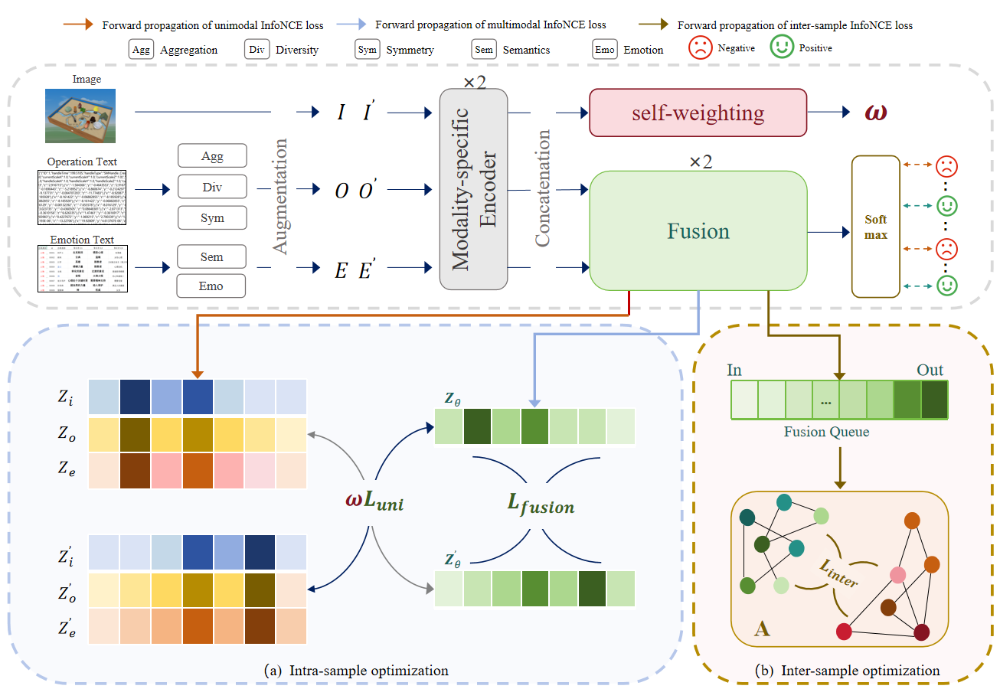

# AMCF: Adaptive Multimodal Contrastive Fusion Method for Affective Analysis of Psychological Sandtray
> AMCF: Adaptive Multimodal Contrastive Fusion Method for Affective Analysis of Psychological Sandtray,         
> Qi Liu, Xiaofei Niu, Zhifang Jiang, Shipeng Zhang, Yaohui Wang, Hongyuan Song, Zeyang Wang, Jianfu Liu

## News
* [2025-12-30] Code has been released.

## Abstract

Mental health disorders have become a critical societal concern. Psychological sandplay, as a non-verbal projective technique, unconsciously externalizes participants' inner psychological states, offering unique advantages for mental health assessment. However, existing sandplay research suffers from limited modality diversity, sparse annotations, and restricted algorithmic performance. Most self-supervised contrastive learning methods emphasize redundant cross-modal information while neglecting equally important modality-specific and synergistic information, focusing solely on intra-sample paired relationships and overlooking dynamic modality contribution variations. To address these limitations, we propose an Adaptive Multimodal Contrastive Fusion (AMCF) framework for affective analysis of multimodal psychological sandplay data to identify abnormal patterns indicative of psychological distress. AMCF employs a progressive modeling strategy: internal fusion maximizes mutual information across multimodal features for representation alignment, while external graph-based optimization with memory queue mechanisms enforces global consistency, achieving progressive modeling from intra-sample alignment to inter-sample associations. During multimodal fusion, AMCF adaptively assigns modality weights based on their task-specific importance in joint representation learning. We evaluate AMCF on four public affective computing benchmarks (CMU-MOSEI, CMU-MOSI, UR-FUNNY, MUStARD) and a newly constructed digital psychological sandplay dataset. Comparative experiments against state-of-the-art methods validate AMCF's effectiveness and robust generalization capability.

